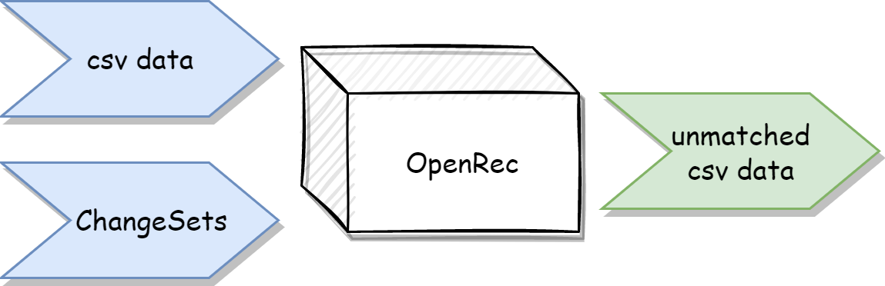
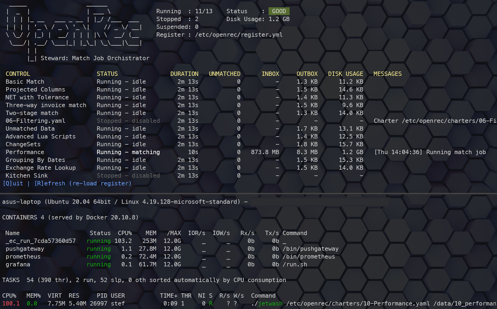
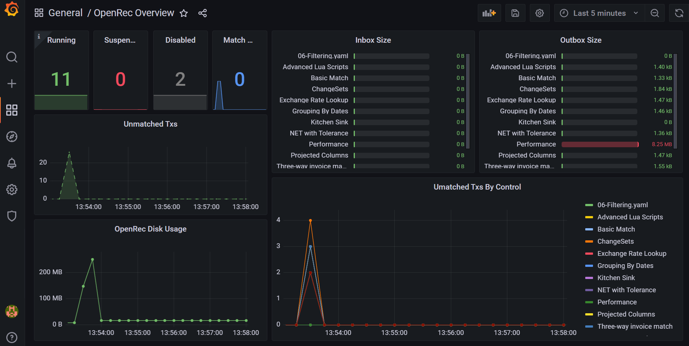

# OpenRec

It's just files.

## What is a OpenRec?

OpenRec is a [reconciliation matching](https://corporatefinanceinstitute.com/resources/knowledge/accounting/reconciliation/) engine written in the [Rust](https://www.rust-lang.org/) language. It can be used to group and match data presented to it in CSV format using easy-to-configure YAML and Lua rules. OpenRec comprises a small number of modules which are intended to be used as libraries and services **within your own enterprise-wide solution**.

The motivation for this project was simply personal. I wished to solve the problem of writing a matching engine in a way that wouldn't consume system (memory) resources in a new, modern language. As a result you should take note: OpenRec is a matching engine, not a full solution.

## OpenRec High-Level Features

### Schema-less

OpenRec will analyse incoming data at runtime to deduce each column's data-type. The only time you'll need to know a column's data-type is it needs to be referenced in a matching rule. Anything not directly involved in a rule is dynamically typed.

### Fast

Always a subjective term - OpenRec is written in [Rust](https://www.rust-lang.org/) an as such is very efficient, quick (instant) to start and typically matching 1-2 million CSV transactions a minute (subject to specific hardware and configuration).

### Lightweight

OpenRec has a very low memory footprint. The matching engine (Celerity) uses an [external merge sort](https://en.wikipedia.org/wiki/External_sorting) algorithm which utilities disk files rather than system RAM to sort and group data. Because of this, you can easily run **any** number of transactions on a system with barely any memory requirements (GBs of transactions can typically use less than 100MB of RAM!).

### Easy to configure

OpenRec configuration files (called **charters**) use a very natural configuration structure which is easy to pick-up and the parser gives great feed-back if mistakes/typos are made.

### Flexible/Extendible

OpenRec configuration utilizes the [Lua scripting](http://lua-users.org/wiki/TutorialDirectory) language to derive calculated fields and evaluate matching rules. Lua is a well documented and OpenRec provides some very handy helper functions which can also be leveraged (there is much more detail in the examples folder).

### Database Free

The core components are entirely file-based requiring no other dependencies - although you can optionally configure Steward to provide [Prometheus](https://prometheus.io/) metrics (via a [Pushgateway](https://github.com/prometheus/pushgateway)). From the outside world, there is an inbox where data is delivered and an outbox where unmatched data is returned (to be consumed by your own systems to allow clerks/operators to investigate and correct).

It's just files.

## Next Steps

If you're interested in discovering more, then you should take a look at the following pages

[OpenRec Concepts](docs/concepts.md) 
[OpenRec Examples](docs/examples.md) 
[Getting Started](docs/getting_started.md) 

Finally there's a [useful page](docs/problems.md) which discusses a possible failure scenario and details how to recover from it - this would be useful information to have on hand.

## Feature Road Map

The following is on my wishlist of things to tackle: -

* [ ] Proposed Groups - The ability to suggest potential groups rather than all/nothing matching.
* [ ] Filters - Jetwash should be able to ignore inbound data matching some criteria.
* [ ] Group Filters - Celerity grouping should be able to ignore records.
* [ ] Abort a changeset - the ability to abort an erroneous changeset.
* [ ] Rollback match jobs - The ability to automatically revert jobs.
* [ ] Record deltas to generate changesets. This would allow external data updates to modify unmatched data.
* [ ] A full-sync control. Where an incoming file represents the current state rather than an appending record batch.
* [ ] Lua updates in changesets. Allow Lua to be executed in a changeset, not just direct field value replacement.
* [ ] Headless mode for Steward. Currently a console-only application.
* [ ] WASM feasibility study. The ability to host the matching engine in a browser would be.... cool.
* [ ] Windows support (I suppose)
* [ ] Prevent a charter being modified during a match job (i.e. Jetwash uses one ver Celerity uses another)
