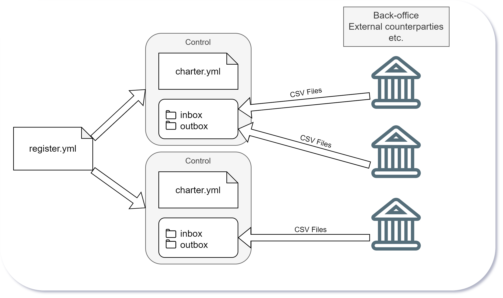
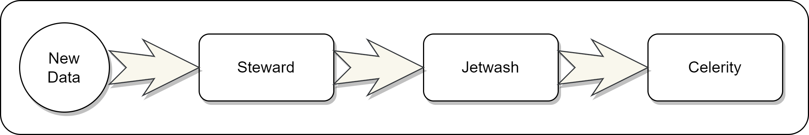

# OpenRec Concepts

  - [Modules](#modules)
  - [Folder Structure](#folder-structure)
  - [File Format](#file-format)
  - [Charters](#charters)
  - [Virtual Grid Model](#virtual-grid-model)
  - [Merging Columns](#merging-columns)
  - [Grouping Data](#grouping-data)
  - [Constraint Rules](#constraint-rules)
  - [Projecting Columns](#projecting-columns)
  - [ChangeSets](#changesets)



A financial **Control** in OpenRec is configured via a single [yaml](https://en.wikipedia.org/wiki/YAML) file called a **charter** and requires a folder structure where data will be imported, manipulated and reconciled.

The charters can be registered in a central registry yaml file - this file is used to the monitoring and processing of the controls. The examples folder is full of documented charter examples - you are encouraged to read those as well.

## Modules

OpenRec is composed of a number of sub-modules.
- **Steward** - Steward is the OpenRec orchestration application. Using the register, Steward will monitor control inboxes for new data and initiate the other OpenRec components to perform a match job. Steward is also responsible for ensuring only one match job per control is invoked at any one time and that metrics are exposed to a [Prometheus](https://prometheus.io/) server (if configured - via a [Pushgateway](https://github.com/prometheus/pushgateway)).
- **Jetwash** - Jetwash is component which pre-processes and cleans the inbox data, trimming whitespace, converting dates to ISO8601 format, etc. As well as adding a schema row and delivers well-formatted data to Celerity.
- **Celerity** - Celerity is the matching engine which ingests data from Jetwash and combines it with any previously unmatched data to group it and evaluate it against defined matching rules. Matched data is 'released' leaving only un-matched data behind.

So the sequence of events is broadly, new data arrives in the inbox, Steward triggers Jetwash, Jetwash then triggers Celerity finally Steward exposes the unmatched data in the outbox.



## Folder Structure
[top](#openrec-concepts)

Each control will operate within it's own folder structure. A control's folder structure should be kept separate from any other controls structure. A typical folder structure looks as follows: -

```
  .
  .
  ├── control_a
  |   ├── inbox          << place csv files here.
  |   ├── archive        << files are archived by default in here.
  |   |   ├── jetwash
  |   |   └── celerity
  |   ├── logs           << jetwash and celerity log files are written here.
  |   ├── lookups        << static reference data csv files go in here.
  |   ├── waiting        << internal queue from Jetwash to Celerity.
  |   ├── unmatched      << internal cache of unmatched data.
  |   ├── matching       << internal working folder for current match job.
  |   ├── matched        << internal archive of match job json files
  |   └── outbox         << external unmatched data should be consumed from here.
  ├── control_b
  |   ├── inbox
  .   .
  .   .
```

***Important!*** Files written into the inbox should have a `.inprogress` suffix. After the file is written, the file should be renamed to remove this suffix. This ensures larger files are not corrupted as OpenRec will begin processing the file before all the data is written.

## File Format
[top](#openrec-concepts)

Jetwash will convert most standard UTF-8 CSV file formats into a format the Celerity matching engine understands.

This is a fully quoted CSV format with a column header row (Jetwash can be configured to add headers to files which don't initially have them).

Following the header row is a second row which contains the data-types of each column. Jetwash will analyse the columns as new data arrives and produce this row automatically, although the types can be overridden in the Jetwash `column_mappings` section of the charter.

The data-types used by Celerity are: -

| Data Type     | Abbreviation  | Examples                             |
| ------------- |:-------------:| ------------------------------------ |
| Boolean       | BO            | 1, 0, y, n, true, false              |
| Datetime      | DT            | 2022-01-03T18:23:00.000Z             |
| Decimal       | DE            | 1234567.8901234567                   |
| Integer       | IN            | 0000123                              |
| String        | ST            | Hello There                          |
| UUID          | ID            | 7d1c7f56-6cc2-11ec-aafd-00155dd15c90 |

A final point about the **Celerity** CSV file format, is that the first column will **always** be called *OpenRecStatus* and contain a single numerical digit. This is used to track a record's status (i.e. matched or unmatched). The second column will always be a unique UUID column called *OpenRecId* - generated by Jetwash.

Here is an example of a file presented to Jetwash called invoices.csv (the separator below is the pipe '|' symbol, but typically you'd use a comma): -

```csv
InvoiceNo|Ref|InvoiceDate|Amount
0001|INV0001|2021-11-25T00:00:00.000Z|1050.99
0002|INV0002|2021-11-26T00:00:00.000Z|500.00
```

Here is the same file after going through Jetwash and being presented to Celerity as 20220103_18400000_invoices.csv: -

```csv
"OpenRecStatus","OpenRecId","InvoiceNo","Ref","InvoiceDate","Amount"
"IN","ID","ST","ST","DT","DE"
"0","01b2e8ee-15f4-4316-a7dc-e2a841a73a93","0001","INV0001","2021-11-25T00:00:00.000Z","1050.99"
"0","388b5e57-a241-48dc-b37b-0a0deac28396","0002","INV0002","2021-11-26T00:00:00.000Z","500.00"
```


## Charters
[top](#openrec-concepts)

Charters are yaml configuration files used to define rules for Jetwash and Celerity. To give you a feel for what one might look like, an example is shown here, don't worry about the details, they will be covered shortly and also explained in more detail in the examples folder.

```yaml
name: Example Control
description: Use this to describe the external systems being matched.
version: 1

jetwash:
  source_files:
   - pattern: ^DealExport\.csv$
     column_mappings:
      - trim: DealRef
      - dmy: EntryDate
      - dmy: DealDate
      - dmy: ValueDate
      - dmy: MaturityDate

   - pattern: ^InternalTrades\.csv$
     column_mappings:
      - dmy: settlement_date
      - dmy: value_date
      - dmy: maturity_date
      - dmy: expiry_date
      - dmy: opening_date

matching:
  source_files:
   - pattern: .*DealExport.*\.csv
     field_prefix: THEIRS

   - pattern: .*InternalTrades.*\.csv
     field_prefix: OURS

  instructions:
    - project:
        column: OUR_DEALREF
        as_a: String
        from: string.match(record["OURS.params"], ".*%s.*%s.*%s(.*)")
        when: record["META.prefix"] == "OURS"

    - merge:
        columns: ['THEIRS.DealRef', 'OUR_DEALREF']
        into: DEAL_REF

    - merge:
        columns: ['THEIRS.Principal', 'OURS.amount']
        into: AMOUNT

    - group:
        by: ['DEAL_REF']
        match_when:
         - nets_to_zero:
            column: AMOUNT
            lhs: record["META.prefix"] == "THEIRS"
            rhs: record["META.prefix"] == "OURS"

```

We'll discuss some of the concepts shown in the above example now.

## Virtual Grid
[top](#openrec-concepts)

The *jetwash* section is used in the first stage to match filenames in the inbox and transform the file and columns before the resultant file is delivered to Celerity where the *matching* section of the file kicks-in. Notice there are two source_files sections with subtly different pattern matches. The first (jetwash) patterns are quite strict and are expecting named files with specific filenames. You can define regular expressions here to match any filenames you want to import into the system. There is no limit on the number of patterns, so you may define 3 for example, for a 3-way reconciliation.

Now shifting focus to the *matching* section of the above file, you'll see the patterns allow for variations in the filename's prefix and middle sections. This is because Jetwash puts a timestamp prefix on every file - so for Celerity to see a file it must allow for this timestamp (in the example above '.\*' is easier to write than '^(\d{8}\_\d{9})_'). In addition to the first '.*' there is a second before the file extension. This is because unmatched data is written to unmatched files which have the word 'unmatched' in this section of the filename. So this new pattern can see both the original files and the renamed un-matched versions of those files. For example, both of these files would be loaded: -

```
20220103_18400000_invoices.csv
20220103_18400000_invoices.unmatched.csv
```

Each pattern may match against zero or more files present in the *waiting* (and *unmatched*) folders. You can think of these files as being loaded into a **single virtual memory grid** (think 'Excel worksheet') which Celerity uses to sort and group.

Note: the grid is referred to as virtual because no data is physically loaded into memory (well, technically not all data is loaded at the same time), however, it remains a useful visualization technique to think of it in this way.

In the above charter, each file is given a *field_prefix* value. This value is appended to each field name loaded from that pattern to ensure it doesn't conflict with other fields from other files which might have the same name. In the example above, all fields from the DealExport.csv files will be prefixed with 'THEIRS' (so 'THEIRS.Principal' is a column for example) and all fields from the InternalTrades.csv files will be prefixed with 'OURS' (so 'OURS.maturity_date' is a column for example).

Let's explore this in more detail, by taking an simple invoice file and payment file (these are not related to the above example charter - and are some new files to illustrate) and put them both in a virtual grid.

Invoice File - our sample invoice file looks like this: -

```csv
"Ref","InvoiceDate","Amount"
"ST","DT","DE"
"INV0001","2021-11-25T00:00:00.000Z","1050.99"
"INV0002","2021-11-26T00:00:00.000Z","500.00"
```

Payment File - our sample payment file looks like this: -

```csv
"PaymentId","Ref","Amount","PaymentDate"
"ST","ST","DE","DT"
"P1","INV0001","50.99","2021-11-27T00:00:00.000Z"
"P2","INV0002","500.00","2021-11-27T00:00:00.000Z"
"P3","INV0001","1000.00","2021-11-28T00:00:00.000Z"
```

Note: For brevity I have ommitted the internally added OpenRec___ columns.

If we had a charter which look like this: -

```yaml
matching:
  source_files:
   - pattern: .*invoices.*\.csv
     field_prefix: INV

   - pattern: .*payments.*\.csv
     field_prefix: PAY

  instructions:
    - merge:
        columns: ['INV.Amount', 'PAY.Amount']
        into: AMOUNT

    - merge:
        columns: ['INV.Ref', 'PAY.Ref']
        into: REF

    - group:
        by: ['REF']
        match_when:
          - nets_to_zero:
              column: AMOUNT
              lhs: record["META.prefix"] == "PAY"
              rhs: record["META.prefix"] == "INV"
```

Then initially when these files are first loaded into the virtual grid (before the instructions section is processed), the grid would look something like this: -

```
INV.Ref  INV.InvoiceDate           INV.Amount  PAY.PaymentId  PAY.Ref  PAY.Amount  PAY.PaymentDate
INV0001  2021-11-25T00:00:00.000Z     1050.99  -              -                 -  -
INV0002  2021-11-26T00:00:00.000Z      500.00  -              -                 -  -
-        -                                  -  P1             INV0001       50.99  2021-11-27T00:00:00.000Z
-        -                                  -  P2             INV0002      500.00  2021-11-27T00:00:00.000Z
-        -                                  -  P3             INV0001     1000.00  2021-11-28T00:00:00.000Z
```

From this stage, the charter has instructions which tell Celerity how to bring columns together so that rows can be grouped and matched.

## Merging Columns
[top](#openrec-concepts)

```yaml
- merge:
    columns: ['INV.Amount', 'PAY.Amount']
    into: AMOUNT
```

After this first merge instruction, the above grid would be modified to look like the grid below. You can see the 'Amount' from both files has be merged into a single column call AMOUNT.

```
 AMOUNT  INV.Ref  INV.InvoiceDate           INV.Amount  PAY.PaymentId  PAY.Ref  PAY.Amount  PAY.PaymentDate
1050.99  INV0001  2021-11-25T00:00:00.000Z     1050.99  -              -                 -  -
 500.00  INV0002  2021-11-26T00:00:00.000Z      500.00  -              -                 -  -
  50.99  -        -                                  -  P1             INV0001       50.99  2021-11-27T00:00:00.000Z
 500.00  -        -                                  -  P2             INV0002      500.00  2021-11-27T00:00:00.000Z
1000.00  -        -                                  -  P3             INV0001     1000.00  2021-11-28T00:00:00.000Z
```

```yaml
- merge:
    columns: ['INV.Ref', 'PAY.Ref']
    into: REF
```

After the final merge REF instruction from the charter the grid will look as follows: -

```
REF       AMOUNT  INV.Ref  INV.InvoiceDate           INV.Amount  PAY.PaymentId  PAY.Ref  PAY.Amount  PAY.PaymentDate
INV0001  1050.99  INV0001  2021-11-25T00:00:00.000Z     1050.99  -              -                 -  -
INV0002   500.00  INV0002  2021-11-26T00:00:00.000Z      500.00  -              -                 -  -
INV0001    50.99  -        -                                  -  P1             INV0001       50.99  2021-11-27T00:00:00.000Z
INV0002   500.00  -        -                                  -  P2             INV0002      500.00  2021-11-27T00:00:00.000Z
INV0001  1000.00  -        -                                  -  P3             INV0001     1000.00  2021-11-28T00:00:00.000Z
```

Now we have two columns we can use to group data and test the groups are valid matches.

## Grouping Data
[top](#openrec-concepts)

```yaml
- group:
    by: ['REF']
    match_when:
      - nets_to_zero:
          column: AMOUNT
          lhs: record["META.prefix"] == "PAY"
          rhs: record["META.prefix"] == "INV"
```

This final instruction does two things, it groups the data by the REF column resulting in a grid like this: -

```
REF       AMOUNT  INV.Ref  INV.InvoiceDate           INV.Amount  PAY.PaymentId  PAY.Ref  PAY.Amount  PAY.PaymentDate
INV0001  1050.99  INV0001  2021-11-25T00:00:00.000Z     1050.99  -              -                 -  -
INV0001    50.99  -        -                                  -  P1             INV0001       50.99  2021-11-27T00:00:00.000Z
INV0001  1000.00  -        -                                  -  P3             INV0001     1000.00  2021-11-28T00:00:00.000Z
-----------------------------------------------------------------------------------------------------------------------------
INV0002   500.00  INV0002  2021-11-26T00:00:00.000Z      500.00  -              -                 -  -
INV0002   500.00  -        -                                  -  P2             INV0002      500.00  2021-11-27T00:00:00.000Z
```

## Constraint Rules
[top](#openrec-concepts)

Then it runs one or more constraint rules to see if each group is a valid match - all constraint rules must evaluate to true for the group to match, in this case there is only one rule, a nets_to_zero rule (other rules are covered in the examples section).

Netting-to-zero is shorthand for the following calculation (using the above example): -
```
  abs(sum(abs(invoice amount)) - sum(abs(payment amount))) must equal zero
  and at least one invoice must exist in the group
  and at least one payment must exist in the group
```
In the example above, you can see that we are using some META data that is appended to the record to identify if it's an invoice or a payment. More metadata fields are available and are covered in one of the examples in the examples folder.

In the above example, both groups will be matched and released from the system as both groups pass their constraints, i.e. they net-to-zero.

As mentioned, there are other constraint rules available, the ability to net with tolerance and you can even write your own custom Lua constraints for scenarios where transactions may have multiple fields involved (ours/theirs flags, etc.). These are covered in more detail in the examples folder.


## Projecting Columns
[top](#openrec-concepts)

As well as merging columns to create new virtual columns, you can also use column projections to calculate new columns of data.

Let take some new example data files where simply merging existing columns together wont be enough to group and match the records and we'll have to start deriving new columns.

Invoice File - our sample invoice file looks like this: -

```csv
"Ref","TotalAmount","Cur","Date"
"ST","DE","ST","DT"
"INV001","750.0000","GBP","2021-11-25T04:36:08.000Z"
"INV002","380.73556","GBP","2021-12-18T08:09:28.000Z"
"INV003","882.7104","GBP","2022-03-20T22:22:48.000Z"
```

Payment File - our sample payment file looks like this: -

```csv
"Ref","Cur","Amount","Date","FXRate"
"ST","ST","DE","DT","DE"
"PAY001XXINV001XX","USD","1000.0000","2021-11-25T04:36:08.000Z","0.75"
"PAY002XXINV002XX","EUR","400.9900","2021-10-21T11:16:08.000Z","0.844"
"PAY003XXINV002XX","EUR","50.0000","2021-10-22T15:02:48.000Z","0.846"
"PAY004XXINV003XX","USD","1234.56","2022-03-20T22:22:48.000Z","0.715"
```

There are two new problems to solve to match this data which weren't present in the previous example.

Firstly, the invoice reference is embedded inside the payment's Ref value. If we are going to use this to group the data it will need extracting into it's own column.

Secondly, the payment currencies are not in the same currency as the currency on the invoice itself, so the amounts won't NET as they are. Fortunately, we've used Jetwash to populate the exchange rates to convert from the payment currency to the invoice currency (Jetwash can do look-ups against static data files when cleansing and importing data).

If we were to load these two files into a virtual grid, then initially they would look like this (I have removed the time portion of the dates for brevity only): -

```
INV.Ref  INV.TotalAmount  INV.Cur INV.Date    PAY.Ref           PAY.Cur PAY.Amount  PAY.Date    PAY.FXRate
INV001         750.00000  GBP     2021-11-25  -                 -                -  -                    -
INV002         380.73556  GBP     2021-12-18  -                 -                -  -                    -
INV003         882.71040  GBP     2022-03-20  -                 -                -  -                    -
-                      -  -       -           PAY001XXINV001XX  USD      1000.0000  2021-11-25       0.750
-                      -  -       -           PAY002XXINV002XX  EUR       400.9900  2021-10-21       0.844
-                      -  -       -           PAY003XXINV002XX  EUR        50.0000  2021-10-22       0.846
-                      -  -       -           PAY004XXINV003XX  USD      1234.5600  2022-03-20       0.715
```

The first instruction in our charter will create a new column which contains the payment amount converted to the invoice currency.

```yaml
- project:
    column: PAY_AMOUNT_BASE
    as_a: Decimal
    from: record["PAY.Amount"] * record["PAY.FXRate"]
    when: record["META.prefix"] == "PAY"
```

The calculation is performed in the *from* field using Lua script. The script is given access to any field on the current record. In this case it is multiplying the *PAY.Amount* field by the *PAY.FXRate* field.

Note, although Lua doesn't natively support precise decimal numbers, the Rust-to-Lua bridge in Celerity ensures the backing value is a precise financial number and wont suffer from floating point precision issues (ed. this is hella-neat by the way).

The *when* clause in the above projection is also Lua script and ensures the from script is only evaluated on payment records - given invoice records don't have a field *PAY.Amount* or *PAY.FXRate* this avoids a nil reference error occurring in the Lua script.

The above projection results in a grid which now looks like this:-

```
PAY_AMOUNT_BASE  INV.Ref  INV.TotalAmount  INV.Cur INV.Date    PAY.Ref           PAY.Cur PAY.Amount  PAY.Date    PAY.FXRate
              -  INV001         750.00000  GBP     2021-11-25  -                 -                -  -                    -
              -  INV002         380.73556  GBP     2021-12-18  -                 -                -  -                    -
              -  INV003         882.71040  GBP     2022-03-20  -                 -                -  -                    -
      750.00000  -                      -  -       -           PAY001XXINV001XX  USD      1000.0000  2021-11-25       0.750
      338.43556  -                      -  -       -           PAY002XXINV002XX  EUR       400.9900  2021-10-21       0.844
       42.30000  -                      -  -       -           PAY003XXINV002XX  EUR        50.0000  2021-10-22       0.846
      882.71040  -                      -  -       -           PAY004XXINV003XX  USD      1234.5600  2022-03-20       0.715
```

You can see how we can now use a new match instruction in the charter to merge *PAY_AMOUNT_BASE* with the *INV.TotalAmount* to create a single *AMOUNT* column we can use for a NETting constraint rule. This can be seen in more detail in the examples folder.

The second problem we wanted to solve was grouping by the invoice reference. We can use the following column projection to extract a new column with the desired value: -

```yaml
- project:
    column: PAYMENT_INV_REF
    as_a: String
    from: string.match(record["PAY.Ref"], "^PAY.*XX(.*)XX$")
    when: record["META.prefix"] == "PAY"
```

Let's unpack what we've just seen before we panic and find another product to do our matching for us! The *column* and *as_a* fields tell Celerity we are creating a new String column called *PAYMENT_INV_REF*.

The next bit is the scary bit, but it's pretty straightforward. We're calling the *match* method on the Lua *string* object which takes two parameters and is used to grab smaller strings from longer strings.

The first parameter is the value from the record's *PAY.Ref* field which has values like 'PAY001XXINV001XX' for example. The second parameter '^PAY.\*XX(.\*)XX$' is a Lua regular expression to pull out the 'INV001' bit from the first parameter, i.e. it gets us the value that we want.

Let's break down each part of the second parameter here: -

| Segment | Description                                                                                                                     |
|---------|---------------------------------------------------------------------------------------------------------------------------------|
| ^PAY    | This means the start of the string must begin with PAY                                                                          |
| .*      | This means match anything in the next bit of the string. In our example this is a number which we're not interested in, eg. 001 |
| XX      | This means the next bit will always be XX                                                                                       |
| (.*)    | This means match anything. The brackets mean capture this bit, it's what we want to return. eg. INV001                          |
| XX      | This means the next bit will always be second XX                                                                                |
| $       | This means the end of the string, so it'll always end XX                                                                        |

Note: You can use Lua *print* statements in the charter configuration to experiment and see what these things do. Although you should always remove print statements before running a charter in production. Also [regex101](https://regex101.com/) is a fantastic site for trying out regular expressions on test values.

You can find much more detail on Lua regular expressions online - they aren't as scary as they first look - but they are epically powerful. For more details see [Lua Regular Expressions](http://lua-users.org/wiki/PatternsTutorial).

Using the above projection results in this grid (I have removed the previous projection for brevity): -

```
PAYMENT_INV_REF  INV.Ref  INV.TotalAmount  INV.Cur INV.Date    PAY.Ref           PAY.Cur PAY.Amount  PAY.Date    PAY.FXRate
-                INV001         750.00000  GBP     2021-11-25  -                 -                -  -                    -
-                INV002         380.73556  GBP     2021-12-18  -                 -                -  -                    -
-                INV003         882.71040  GBP     2022-03-20  -                 -                -  -                    -
INV001           -                      -  -       -           PAY001XXINV001XX  USD      1000.0000  2021-11-25       0.750
INV002           -                      -  -       -           PAY002XXINV002XX  EUR       400.9900  2021-10-21       0.844
INV002           -                      -  -       -           PAY003XXINV002XX  EUR        50.0000  2021-10-22       0.846
INV003           -                      -  -       -           PAY004XXINV003XX  USD      1234.5600  2022-03-20       0.715
```

Again, you should see how we can now merge *PAYMENT_INV_REF* with *INV.Ref* to create a new *REF* column which can be used to group the data by invoice.

## ChangeSets
[top](#openrec-concepts)

ChangeSets are a data modification mechanism that allow ad-hoc corrections to be made to data which is unmatched (and wont be matched by new incoming data). For example, suppose we generated an internal trade record and, due to an error in a counterparty's system, no corresponding transaction will ever be sent to reconcile with our (now permanently) unmatched record. In this scenario, we can submit an *IgnoreRecords* request for the internal trade. This will effectively release the record from the system, removing it from the unmatched data set.

ChangeSets filenames should take the form YYYYMMDD_HHMMSSsss_changeset.json (to ensure chronological processing) and be placed in the inbox folder. Here is an example of an instruction to ignore a record.

```json
[
  {
    "id": "f3377a6c-6324-11ec-bc4d-00155ddc3e05",
    "change": {
        "type": "IgnoreRecords",
        "lua_filter": "record[\"OpenRecId\"] == \"7e185ed4-6d76-11ec-9ea0-00155dd154c9\""
    },
    "timestamp": "2021-12-20T06:18:00.000Z"
  }
]
```

As you can probably tell, A ChangeSet can contain a list of instructions to modify data. And as shown in the above example, an instruction has a Lua filter script to allow a single modification to apply to more than one un-matched record.

Supposing a file of data was submitted with a record whose amount value was incorrect. A single ChangeSet instruction could be issued to correct the value allowing the record to be matched.

```json
[
  {
    "id": "f3916ea0-6324-11ec-a8e6-00155ddc3e05",
    "change": {
        "type": "UpdateFields",
        "updates": [ { "field": "Amount", "value": "444.00" } ],
        "lua_filter": "record[\"TransId\"] == 123"
    },
    "timestamp": "2021-12-20T06:18:00.000Z"
  }
]
```

Again, because you're very astute, you can probably see this single update can effect multiple fields on the record(s) it's to be applied to.

Note: All changesets are applied to un-matched data as part of a match job - prior to celerity performing any charter instructions on it.
